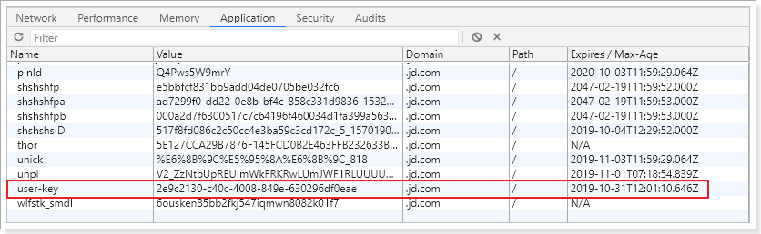
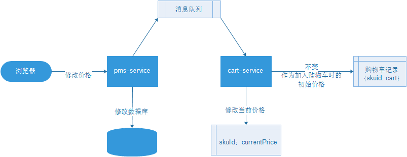

# 1. 购物车功能分析

## 1.1.   需求

需求描述：

- 用户可以在登录状态下将商品添加到购物车
  - 放入数据库
  - mongodb
  - 放入redis（采用）
- 用户可以在未登录状态下将商品添加到购物车
  - 放入localstorage
  - cookie
  - webSQL
  - 放入redis（采用）
- 用户可以使用购物车一起结算下单
- 用户可以查询自己的购物车
- 用户可以在购物车中修改购买商品的数量。
- 用户可以在购物车中删除商品。
- 在购物车中展示商品优惠信息
- 提示购物车商品价格变化


## 1.2.   数据结构

首先分析一下购物车的数据结构


因此每一个购物车信息，都是一个对象，基本字段包括：

```js
{
    skuId: 2131241,
    title: "Apple iphone.....",
    defaultImage: "...",
    price: 4999,
    count: 1,
    skuSaleVO: {...}
}
```

另外，购物车中不止一条数据，因此最终会是对象的数组。即：

```js
[
    {...},{...},{...}
]
```


Redis有5种不同数据结构，这里选择哪一种比较合适呢？Map<String, List<String>>

- 首先不同用户应该有独立的购物车，因此购物车应该以用户的作为key来存储，Value是用户的所有购物车信息。这样看来基本的`k-v`结构就可以了。
- 但是，我们对购物车中的商品进行增、删、改操作，基本都需要根据商品id进行判断，为了方便后期处理，我们的购物车也应该是`k-v`结构，key是商品id，value才是这个商品的购物车信息。

综上所述，我们的购物车结构是一个双层Map：Map<String,Map<String,String>> 

- 第一层Map，Key是用户id
- 第二层Map，Key是购物车中商品id，值是购物车数据


## 1.3.   流程

参照jd：



user-key是随机生成的id，不管有没有登录都会有这个cookie信息。

两个功能：新增商品到购物车、查询购物车。

新增商品：判断是否登录

- 是：则添加商品到后台Redis中，把user的唯一标识符作为key。
- 否：则添加商品到后台redis中，使用随机生成的user-key作为key。

查询购物车列表：判断是否登录

- 否：直接根据user-key查询redis中数据并展示
- 是：已登录，则需要先根据user-key查询redis是否有数据。
  - 有：需要提交到后台添加到redis，合并数据，而后查询。
  - 否：直接去后台查询redis，而后返回。


# 2. 搭建购物车服务


pom依赖：

```xml
<?xml version="1.0" encoding="UTF-8"?>
<project xmlns="http://maven.apache.org/POM/4.0.0" xmlns:xsi="http://www.w3.org/2001/XMLSchema-instance"
         xsi:schemaLocation="http://maven.apache.org/POM/4.0.0 https://maven.apache.org/xsd/maven-4.0.0.xsd">
    <modelVersion>4.0.0</modelVersion>
    <parent>
        <groupId>org.springframework.boot</groupId>
        <artifactId>spring-boot-starter-parent</artifactId>
        <version>2.1.9.RELEASE</version>
        <relativePath/> <!-- lookup parent from repository -->
    </parent>
    <groupId>com.atguigu</groupId>
    <artifactId>gmall-cart</artifactId>
    <version>0.0.1-SNAPSHOT</version>
    <name>gmall-cart</name>
    <description>谷粒商城购物车系统</description>

    <properties>
        <java.version>1.8</java.version>
        <spring-cloud.version>Greenwich.SR3</spring-cloud.version>
    </properties>

    <dependencies>
        <dependency>
            <groupId>com.atguigu</groupId>
            <artifactId>gmall-core</artifactId>
            <version>1.0-SNAPSHOT</version>
            <exclusions>
                <exclusion>
                    <groupId>com.baomidou</groupId>
                    <artifactId>mybatis-plus-boot-starter</artifactId>
                </exclusion>
            </exclusions>
        </dependency>
        <dependency>
            <groupId>com.atguigu</groupId>
            <artifactId>gmall-pms-interface</artifactId>
            <version>0.0.1-SNAPSHOT</version>
        </dependency>
        <dependency>
            <groupId>com.atguigu</groupId>
            <artifactId>gmall-sms-interface</artifactId>
            <version>0.0.1-SNAPSHOT</version>
        </dependency>
        <dependency>
            <groupId>org.springframework.boot</groupId>
            <artifactId>spring-boot-starter-actuator</artifactId>
        </dependency>
        <dependency>
            <groupId>org.springframework.boot</groupId>
            <artifactId>spring-boot-starter-data-redis</artifactId>
        </dependency>
        <dependency>
            <groupId>org.springframework.boot</groupId>
            <artifactId>spring-boot-starter-web</artifactId>
        </dependency>
        <dependency>
            <groupId>org.springframework.cloud</groupId>
            <artifactId>spring-cloud-starter-openfeign</artifactId>
        </dependency>

        <dependency>
            <groupId>org.springframework.boot</groupId>
            <artifactId>spring-boot-starter-test</artifactId>
            <scope>test</scope>
        </dependency>
    </dependencies>

    <dependencyManagement>
        <dependencies>
            <dependency>
                <groupId>org.springframework.cloud</groupId>
                <artifactId>spring-cloud-dependencies</artifactId>
                <version>${spring-cloud.version}</version>
                <type>pom</type>
                <scope>import</scope>
            </dependency>
        </dependencies>
    </dependencyManagement>

    <build>
        <plugins>
            <plugin>
                <groupId>org.springframework.boot</groupId>
                <artifactId>spring-boot-maven-plugin</artifactId>
            </plugin>
        </plugins>
    </build>

</project>
```

bootstrap.yml：

```yaml
spring:
  application:
    name: cart-service
  cloud:
    nacos:
      config:
        server-addr: 127.0.0.1:8848
```

application.yml：

```yml
server:
  port: 8090
spring:
  cloud:
    nacos:
      discovery:
        server-addr: 127.0.0.1:8848
  redis:
    host: 172.16.116.100
```

启动类：

```java
@SpringBootApplication
@EnableDiscoveryClient
@EnableFeignClients
public class GmallCartApplication {

    public static void main(String[] args) {
        SpringApplication.run(GmallCartApplication.class, args);
    }

}
```

网关配置：


## 2.1.   添加登录校验

购物车系统根据用户的登录状态，购物车的增删改处理方式不同，因此需要添加登录校验，我们通过JWT鉴权即可实现。而登录状态如果在每个方法中进行校验，会造成代码的冗余，不利于维护。所以这里使用拦截器统一处理。


### 2.1.1.   配置公钥

```yaml
gmall:
  jwt:
    pubKeyPath: C:/tmp/rsa/rsa.pub # 公钥地址
    cookieName: GMALL_TOKEN # cookie的名称
    userKeyName: user-key # 未登录购物车的唯一标识
    expire: 43200 # 过期时间，一个月
```


### 2.1.2.   加载公钥

 

代码：

```java
@Data
@Slf4j
@ConfigurationProperties(prefix = "gmall.jwt")
public class JwtProperties {

    private String pubKeyPath;// 公钥

    private PublicKey publicKey; // 公钥

    private String cookieName;

    private String userKeyName;

    private Integer expire;

    @PostConstruct
    public void init(){
        try {
            // 获取公钥和私钥
            this.publicKey = RsaUtils.getPublicKey(pubKeyPath);
        } catch (Exception e) {
            log.error("初始化公钥失败！", e);
            throw new RuntimeException();
        }
    }

}
```


### 2.1.3.   编写拦截器

因为很多接口都需要进行登录，我们直接编写SpringMVC拦截器，进行统一登录校验。同时，我们还要把解析得到的用户信息保存起来，以便后续的接口可以使用。

 

代码：

```java
@EnableConfigurationProperties(JwtProperties.class)
@Component
public class LoginInterceptor extends HandlerInterceptorAdapter {

    private static final ThreadLocal<UserInfo> THREAD_LOCAL = new ThreadLocal<>();

    @Autowired
    private JwtProperties jwtProperties;

    @Override
    public boolean preHandle(HttpServletRequest request, HttpServletResponse response, Object handler) throws Exception {
        // 获取cookie信息
        String token = CookieUtils.getCookieValue(request, jwtProperties.getCookieName());
        String userKey = CookieUtils.getCookieValue(request, jwtProperties.getUserKeyName());

        // 如果都为空，设置userKey。
        if (StringUtils.isBlank(token) && StringUtils.isBlank(userKey)){
            userKey = UUID.randomUUID().toString();
            CookieUtils.setCookie(request, response, jwtProperties.getUserKeyName(), userKey, jwtProperties.getExpire());
        }

        // 不管有没有登录都要设置userKey
        UserInfo userInfo = new UserInfo();
        userInfo.setUserKey(userKey);

        // token不为空,解析token
        if (StringUtils.isNotBlank(token)){
            Map<String, Object> map = JwtUtils.getInfoFromToken(token, jwtProperties.getPublicKey());
            if (!CollectionUtils.isEmpty(map)) {
                userInfo.setId(new Long(map.get("id").toString()));
            }
        }

        // 保存到threadlocal
        THREAD_LOCAL.set(userInfo);

        // 如果token不为空，
        return true;
    }

    @Override
    public void afterCompletion(HttpServletRequest request, HttpServletResponse response, Object handler, Exception ex) throws Exception {
        THREAD_LOCAL.remove();
    }

    public static UserInfo getUserInfo(){
        return THREAD_LOCAL.get();
    }
}
```

注意：

- 这里我们使用了`ThreadLocal`来存储查询到的用户信息，线程内共享，因此请求到达`Controller`后可以共享User
- 并且对外提供了静态的方法：`getUserInfo()`来获取User信息


这里需要UserInfo类：

 

```java
@Data
public class UserInfo {

    private Long id;

    private String userKey;
}
```


### 2.1.4.   配置拦截器

配置SpringMVC，使过滤器生效：

 

```java
@Configuration
public class MvcConfig implements WebMvcConfigurer {

    @Autowired
    private LoginInterceptor loginInterceptor;

    @Override
    public void addInterceptors(InterceptorRegistry registry) {
        registry.addInterceptor(loginInterceptor).addPathPatterns("/**");
    }
}
```


## 2.2.   feign接口及实体类

购物车实体类：

```java
@Data
public class Cart {

    private Long skuId;// 商品id
    private String title;// 标题
    private String defaultImage;// 图片
    private BigDecimal price;// 加入购物车时的价格
    private Integer count;// 购买数量
    private List<SkuSaleAttrValueEntity> skuAttrValue;// 商品规格参数
    private SkuSaleVO skuSaleVO;
}
```


Feign接口：

 

```java
@FeignClient("pms-service")
public interface GmallPmsFeign extends GmallPmsApi {
}
```

```java
@FeignClient("sms-service")
public interface GmallSmsFeign extends GmallSmsApi {
}
```


在gmall-pms工程的SkuSaleAttrValueController中新增根据skuId查询销售属性及值：

```java
@ApiOperation("查询sku的所有销售属性")
@GetMapping("/sku/{skuId}")
public Resp<List<SkuSaleAttrValueEntity>> querySkuSaleAttrValueBySkuId(@PathVariable("skuId")Long skuId){

    List<SkuSaleAttrValueEntity> skus = this.skuSaleAttrValueService.list(new QueryWrapper<SkuSaleAttrValueEntity>().eq("sku_id", skuId));

    return Resp.ok(skus);
}
```

给gmall-pms-interface工程的GmallPmsApi添加接口方法：

```java
@GetMapping("pms/skusaleattrvalue/sku/{skuId}")
public Resp<List<SkuSaleAttrValueEntity>> querySkuSaleAttrValueBySkuId(@PathVariable("skuId")Long skuId);
```


## 2.3.   添加商品到购物车

### 2.3.1.   CartController

先分析一下：

- 请求方式：新增，肯定是Post

- 请求路径：/cart 

- 请求参数：

  ```json
  {
  	"skuId": 40,
  	"count": 2
  }
  ```

- 返回结果：无

```java
@RestController
@RequestMapping("cart")
public class CartController {

    @Autowired
    private CartService cartService;

    @PostMapping
    public Resp<Object> addCart(@RequestBody Cart cart) {

        this.cartService.addCart(cart);

        return Resp.ok(null);
    }
}
```


### 2.3.2.   CartService

这里我们不访问数据库，而是直接操作Redis。基本思路：

- 先查询之前的购物车数据
- 判断要添加的商品是否存在
  - 存在：则直接修改数量后写回Redis
  - 不存在：新建一条数据，然后写入Redis

代码：

```java
@Service
public class CartService {

    @Autowired
    private GmallPmsFeign gmallPmsFeign;

    @Autowired
    private StringRedisTemplate redisTemplate;

    private static final String CART_PREFIX = "cart:uid:";

    public void addCart(Cart cart) {

        // 获取userInfo
        UserInfo userInfo = LoginInterceptor.getUserInfo();

        // 获取redis的key
        String key = CART_PREFIX;
        if (userInfo.getId() == null) {
            key += userInfo.getUserKey();
        } else {
            key += userInfo.getId();
        }

        // 查询用户购物车
        BoundHashOperations<String, Object, Object> hashOps = this.redisTemplate.boundHashOps(key);
        // 判断购物车是否存在
        Long skuId = cart.getSkuId();
        Integer count = cart.getCount();
        // 注意这里的skuId要转化成String，因为redis中保存的都是String
        if (hashOps.hasKey(skuId.toString())){
            // 购物车已存在该记录，更新数量
            String cartJson = hashOps.get(skuId.toString()).toString();
            cart = JSON.parseObject(cartJson, Cart.class);
            cart.setCount(cart.getCount() + count);
        } else {
            // 购物车不存在该记录，新增记录
            Resp<SkuInfoEntity> skuResp = this.gmallPmsFeign.querySkuById(skuId);
            SkuInfoEntity skuInfoEntity = skuResp.getData();
            cart.setCount(count);
            cart.setDefaultImage(skuInfoEntity.getSkuDefaultImg());
            cart.setPrice(skuInfoEntity.getPrice());
            cart.setTitle(skuInfoEntity.getSkuTitle());
            Resp<List<SkuSaleAttrValueEntity>> saleAttrValueResp = this.gmallPmsFeign.querySkuSaleAttrValueBySkuId(skuId);
            cart.setSkuAttrValue(saleAttrValueResp.getData());
            // 营销信息 TODO
            cart.setSkuSaleVO(null);
        }
        // 将购物车记录写入redis
        hashOps.put(skuId.toString(), JSON.toJSONString(cart));
    }

}
```


### 2.3.3.   结果

测试未登录状态的购物车：


响应：


redis的数据：


再次发送相同参数的请求，购物车数量会累计；换个skuId的商品，该游客会有两条购物车记录


测试已登录状态的购物车：

给PostMain增加一个cookie：


点击save即可，效果如下：


加入购物车测试效果：


## 2.4.   查询购物车

1. 先根据user-key查询购物车中记录
2. 判断是否登录，未登录直接返回
3. 已登录，合并购物车中的记录并删除未登录状态的购物车
4. 查询购物车记录


### 2.4.1.   CartController

- 请求方式：GET
- 请求路径：/cart 
- 请求参数：无
- 返回结果：购物车列表

```java
@GetMapping
public Resp<List<Cart>> queryCarts() {

    List<Cart> carts = this.cartService.queryCarts();

    return Resp.ok(carts);
}
```


### 2.4.2.   CartService

```java
public List<Cart> queryCarts() {

    UserInfo userInfo = LoginInterceptor.getUserInfo();

    // 查询未登录购物车
    List<Cart> userKeyCarts = null;
    String userKey = CART_PREFIX + userInfo.getUserKey();
    BoundHashOperations<String, Object, Object> userKeyOps = this.redisTemplate.boundHashOps(userKey);
    List<Object> cartJsonList = userKeyOps.values();
    if (!CollectionUtils.isEmpty(cartJsonList)) {
        userKeyCarts = cartJsonList.stream().map(cartJson -> JSON.parseObject(cartJson.toString(), Cart.class)).collect(Collectors.toList());
    }

    // 判断用户是否登录，未登录直接返回
    if (userInfo.getId() == null) {
        return userKeyCarts;
    }

    // 用户已登录，查询登录状态的购物车
    String key = CART_PREFIX + userInfo.getId();
    BoundHashOperations<String, Object, Object> userIdOps = this.redisTemplate.boundHashOps(key); // 获取登录状态的购物车

    // 如果未登录状态的购物车不为空，需要合并
    if (!CollectionUtils.isEmpty(userKeyCarts)) {
        // 合并购物车
        userKeyCarts.forEach(userKeyCart -> {
            Long skuId = userKeyCart.getSkuId();
            Integer count = userKeyCart.getCount();
            if (userIdOps.hasKey(skuId.toString())) {
                // 购物车已存在该记录，更新数量
                String cartJson = userIdOps.get(skuId.toString()).toString();
                userKeyCart = JSON.parseObject(cartJson, Cart.class);
                userKeyCart.setCount(userKeyCart.getCount() + count);
            }
            // 购物车不存在该记录，新增记录
            userIdOps.put(skuId.toString(), JSON.toJSONString(userKeyCart));
        });
        // 合并完成后，删除未登录的购物车
        this.redisTemplate.delete(userKey);
    }

    // 返回登录状态的购物车
    List<Object> userCartJsonList = userIdOps.values();
    if (!CollectionUtils.isEmpty(userCartJsonList)) {
        return userCartJsonList.stream().map(userCartJson -> JSON.parseObject(userCartJson.toString(), Cart.class)).collect(Collectors.toList());
    }

    return null;
}
```


### 2.4.3.   测试

此时redis中，登录状态有两个数据，未登录状态也有两个数据，其中有一条是共有购物车记录。

未登录时：


登录状态：


redis中的数据已合并，并把未登录状态的购物车删除


## 2.5.   修改商品数量

修改数量非常简单

- 请求方式：Post
- 请求路径：/cart/update
- 请求参数：同新增
- 返回结果：无


> Controller

```java
@PostMapping("update")
public Resp<Object> updateCart(@RequestBody Cart cart) {

    this.cartService.updateCart(cart);

    return Resp.ok(null);
}
```

> Service

```java
public void updateCart(Cart cart) {

    // 获取登陆信息
    UserInfo userInfo = LoginInterceptor.getUserInfo();

    // 获取redis的key
    String key = CART_PREFIX;
    if (userInfo.getId() == null) {
        key += userInfo.getUserKey();
    } else {
        key += userInfo.getId();
    }

    // 获取hash操作对象
    BoundHashOperations<String, Object, Object> hashOperations = this.redisTemplate.boundHashOps(key);
    String skuId = cart.getSkuId().toString();
    if (hashOperations.hasKey(skuId)) {
        // 获取购物车信息
        String cartJson = hashOperations.get(skuId).toString();
        Integer count = cart.getCount();
        cart = JSON.parseObject(cartJson, Cart.class);
        // 更新数量
        cart.setCount(count);
        // 写入购物车
        hashOperations.put(cart.getSkuId().toString(), JSON.toJSONString(cart));
    }
}
```


## 2.6.   删除购物车商品

修改数量非常简单

- 请求方式：Post
- 请求路径：/cart/{skuId}
- 请求参数：skuId
- 返回结果：无

> Controller

```java
@PostMapping("{skuId}")
public Resp<Object> deleteCart(@PathVariable("skuId")Long skuId){

    this.cartService.deleteCart(skuId);

    return Resp.ok(null);
}
```


> Service

```java
public void deleteCart(Long skuId) {
    // 获取登陆信息
    UserInfo userInfo = LoginInterceptor.getUserInfo();

    // 获取redis的key
    String key = CART_PREFIX;
    if (userInfo.getId() == null) {
        key += userInfo.getUserKey();
    } else {
        key += userInfo.getId();
    }
    BoundHashOperations<String, Object, Object> hashOperations = this.redisTemplate.boundHashOps(key);
    hashOperations.delete(skuId.toString());
}
```


## 2.7.   购物车价格同步

商品加入购物车之后，商品的价格可能会被修改，会导致redis中购物车记录的价格和数据库中的价格不一致。需要进行同步，甚至是比价：


解决方案：

1. 每次查询购物车从数据库查询当前价格（需要远程调用，影响系统并发能力）
2. 商品修改后发送消息给购物车同步价格（推荐）


pms-service微服务价格修改后，发送消息给购物车，购物车获取消息后，怎么进行价格的同步？

1. 获取所有人的所有购物车记录，更新对应skuId购物车记录的价格（数据量庞大，效率低下）
2. redis中单独维护一个商品的价格，数据结构：{skuId: price}

如果使用第二种方案，redis中应该保存两份数据，一份购物车记录数据，一份sku最新价格数据


价格同步的流程如下：



那么查询购物车时，需要从redis中查询最新价格。


### 2.7.1.   改造新增购物车

声明前缀：


改造新增购物车方法：


### 2.7.2.   改造查询购物车

给cart追加一个字段：currentPrice

```java
@Data
public class Cart {

    private Long skuId;// 商品id
    private String title;// 标题
    private String defaultImage;// 图片
    private BigDecimal price;// 加入购物车时的价格
    private BigDecimal currentPrice; // 商品的当前价格
    private Integer count;// 购买数量
    private List<SkuSaleAttrValueEntity> skuAttrValue;// 商品规格参数
    private SkuSaleVO skuSaleVO;
}
```


### 2.7.3.   修改时的价格同步

略。。。。


